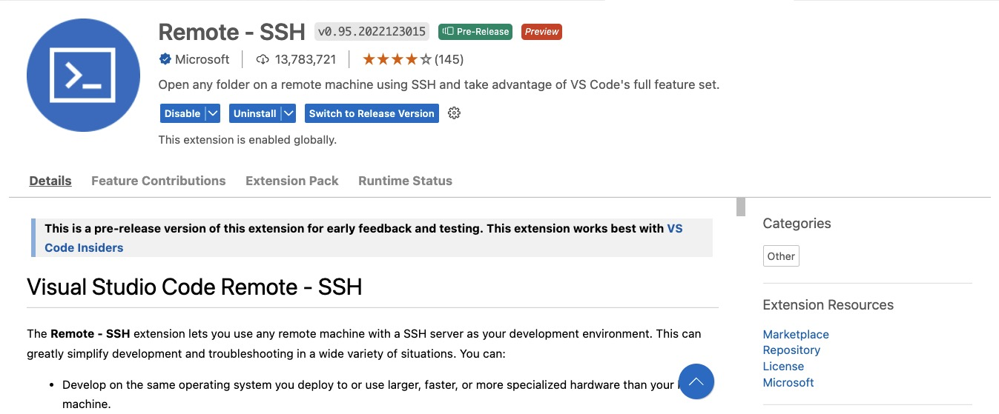
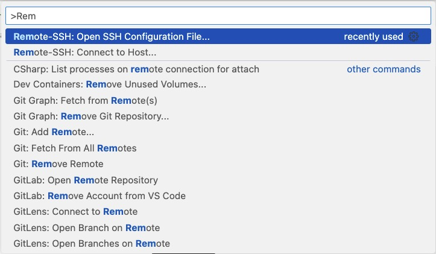
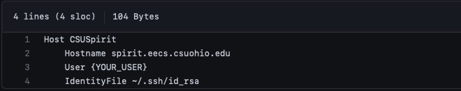
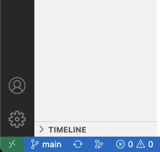

CSU Linux Visual Studio Code Guide
============
#### Table Of Contents
- [VScode Preparation](#visual-studio-installation-and-setup)
- [SSH key](setting-up-ssh-keys)
- [VScode Configuration](finalizing-visual-studio)
- [Using Remote SSH](opening-up-spirit-with-visual-studio-code)

Most teachers here at CSU will recommend that you use some version of a client manager to set up you remote connection with CSU's remote linux server. While this option is completely fine and can be helpful to work with the software your professor is comfortable with, it does has it's drawbacks. The main issue I saw with using a client manager such as [MobaXTerm](https://mobaxterm.mobatek.net/download.html), [BitVise](https://www.bitvise.com/ssh-client-download), or [puTTY](https://www.putty.org) is that you are limited to the tools that are local to that server. For example, your Text Editors will stay [nano](https://www.nano-editor.org/docs.php) or [Vim](https://www.vim.org/docs.php) which for most Computer Science Students can be a pain to start on. Also, as you progress in your coursework and on to courses like CIS 345 you will ne to manage and view multiple files at once, which I found extremely hard to do with the default setup. 

This should be a comprehensive guide to help you set up Visual Studio Code as your Client Manager for any CSU Linux needs. If you have any questions please reach out to my contact information that is located both above and below. If this is helpful to you please consider giving my repo a :star: and sharing it! Cheers!

## Visual Studio Installation and Setup 

As we will be using VScode as our preferred way to log in spirit and grail the first thing we need to do is install it to our local machine. Please click [here](https://code.visualstudio.com/download) to be redirected to the VScode download page. From here select the correct download for the current operating system on your device (Windows, MacOS, or Linux). 

Assuming this is your first time using VScode consider taking the time to check our my other guide on my GitHub titled [Starting VScode Guide]() to help with learning how to use this widely verbose Text Editor! 

To make sure we are set up to connect to our remote server we will be using one extension to assist us with that process. To download our needed extension, either click [Remote - SSH](https://marketplace.visualstudio.com/items?itemName=ms-vscode-remote.remote-ssh) or open your extensions tab in VSCode and type "Remote - SSH" in. Proceed to download the extension to your machine!



For the time being we are all ready for our next steps! 

## Setting Up SSH keys

Our next step will be setting up a [SSH key](https://jumpcloud.com/blog/what-are-ssh-keys) from our machine to CSU's server so we no longer need to log in using our password. This gives VSCode the ability to open up your session directly.  

For this step there are some differences based on the OS that you are running. Below I will have both MacOS and Windows detailed, as those are what I am familiar with. If you are running linux I assume that the commands used within our MacOS instruction will work as we are using very basic commands that they both share. 

[MacOS Instructions](#macos)
[Windows Instructions](#windows)

___
##### MacOS
*Overview of Commands*
```bash
> pwd
> cd .ssh
> ssh-keygen
... returns 3 prompts (HIT ENTER FOR EACH)
> cat ~/.ssh/id_rsa.pub | ssh {your_username}@spirit.eecs.csuohio.edu 'cat >> ~/.ssh/authorized_keys'
{your_username}'s password: (ENTER YOUR PASSWORD)
Welcome to Ubuntu 20.04.5 LTS (GNU/Linux 5.14.0-1054-oem x86_64) 
```

*Instructions*
To start we need to open our terminal of choice. If you have not used Terminal before it will probably hidden in your applications within a folder. It can be accessed through the applications page or using spotlight search. When located open up terminal and run `pwd` to make sure your are in your user directory.  

When creating our SSH key we want to store it inside a hidden folder within our file directory. To view your hidden folders within our terminal typeing the command `ls -a` to return all dot folders which are located in the current directory. After running that command if you dont see a folder called  **.ssh**, we will need to make one! To make a folder inside of terminal we will run the command `mkdir .ssh`. 

Now that we have located the folder, we need to enter it using the `cd` command. Running `cd .ssh` will now navigate you into the __.ssh__ folder. 

Next, we will be creating a SSH key within this folder. To do that we run the command `ssh-keygen`, this will immediately prompt you with 3 questions prior. For our purposes it is important you hit enter for each prompt as it will keep names consistent going forward. If all goes well it should display the key as a weird ASCII drawing. Congrats you have successfully created your key. 

The next step will giving your SSH key to our linux server so that they can identify what computer is logging it. This will bypass your login going forward. 

For this to occur we need to run two commands within our terminal, specifically from our __.ssh__ directory. For ease of use I have piped the two commands together as they are shown below:

>**Before Pasting this Command**
>Make sure your remove *{your_username}* and replace it with your spirit login. If you are unaware of your Linux Username or Password, please contact your professor.

```
cat ~/.ssh/id_rsa.pub | ssh {your_username}@spirit.eecs.csuohio.edu 'cat >> ~/.ssh/authorized_keys'
```

If all is well, after this is ran with your username it will ask for your password to access our server . Enter your linux password and you will have successfully added your public SSH key to the spirit. 

To test if this is working properly, you can attempt to login to spirit through your terminal *(command below)*. If it doesn't ask for your passcode and immediately log you are good!

```
ssh {your_username}@spirit.eecs.csuohio.edu
```
___
##### Windows
*Overview of Commands*
```PowerShell
> pwd
> md .ssh
> cd .ssh
> ssh-keygen
... returns 3 prompts (HIT ENTER FOR EACH)
> cat ~/.ssh/id_rsa.pub | ssh {your_username}@spirit.eecs.csuohio.edu 'cat >> ~/.ssh/authorized_keys'
{your_username}'s password: (ENTER YOUR PASSWORD)
Welcome to Ubuntu 20.04.5 LTS (GNU/Linux 5.14.0-1054-oem x86_64) 
```

*Instructions*
To make sure that the commands I have provided work properly we will be using [Windows PowerShell](https://learn.microsoft.com/en-us/powershell/). If you are new to end up liking working within PowerShell I recommend downloading [Windows Terminal](https://apps.microsoft.com/store/detail/windows-terminal/9N0DX20HK701?hl=en-us&gl=us&rtc=1) and installing [Oh-my-Posh](https://ohmyposh.dev/) to improve quality of life when using PowerShell. 

Back to our guide, where we need to open and run Windows PowerShell as administrator. Just to make sure you are in tyhe user directory of choice run `pwd` to confirm.  

When creating our SSH key we want to store it inside a hidden folder within our file directory. To view all your folders within our PowerShell type the command `ls` and hit enter. By default Windows 10 does not come with a **.ssh** folder so we will need to create it. To make a folder inside of PowerShell we will run the command `md .ssh`. 

Now that we have created the folder, we need to enter it using the `cd` command. Running `cd .ssh` will now navigate you into the __.ssh__ folder. 

Next, we will be creating a SSH key within this folder. To do that we run the command `ssh-keygen`, this will immediately prompt you with 3 questions after hitting enter. For our purposes it is important you hit enter for each prompt as it will keep names consistent going forward. If all goes well it should display the key as a weird ASCII drawing. Congrats you have successfully created your key. 

The next step will giving your SSH key to our linux server so that they can identify what computer is logging it. This will bypass your need to login using a password going forward. 

For this to occur we need to run two commands within our PowerShell, specifically from our __.ssh__ directory. For ease of use I have piped the two commands together as they are shown below:

>**Before Pasting this Command**
>Make sure your remove *{your_username}* and replace it with your spirit login. If you are unaware of your Linux Username or Password, please contact your professor.

```
cat ~/.ssh/id_rsa.pub | ssh {your_username}@spirit.eecs.csuohio.edu 'cat >> ~/.ssh/authorized_keys'
```


If all is well, after this is ran with your username it will ask for your password to access our server . Enter your linux password and you will have successfully added your public SSH key to the spirit. 

To test if this is working properly, you can attempt to login to spirit through your terminal *(command below)*. If it doesn't ask for your passcode and immediately log you are good!

```
ssh {your_username}@spirit.eecs.csuohio.edu
```
___

#### Finalizing Visual Studio

Now that we have our full setup your SSH key VSCode will be able to log directly into our Linux server to act as a Client. For the next steps we need to configure your host settings so Visual Studio Code knows where we are logging into. 




For this part, open visual studio and run the command `ctrl + shift + p`. For those familiar with VSCode they will know this allows us to search any command or setting within the Editor. Then we want to search "Remote-SSH: Open SSH Configuration File" and select this command. It will then ask you for the location of your config file to which I would recommend going with the defaulted directory in your recommended options. 

Click on the desired directory and you will be taken to the configuration file for the Remote-SSH Extension. Within my repository I have example of what to paste to this file, but make sure you replace {YOUR_USER} with your linux login. Once done with this, hit `cmd + s` to save your config file. You are now free to exit this file. 



#### Opening up Spirit with Visual Studio Code



Now to use VSCode as your client, you need to run Remote SSH and selection CSULinux from your list of hosts. To do this please click the __><__ in the bottom left of your window on visual studio code. To enter spirit please select either 'Connect to Host' or 'Connect Current Window to Host' then select CSULinux. This will open up a connection to CSU's server, and give you the option to select which folders you would like to see when it is established. Dont be concerned if the first time takes a minute to connect as this is normal. 

Once connected you are free to use the Linux server for all of your homework or development needs. Rememeber this gives you a secure connection to our Spirit server, which is made for testing and development, not your Grail server as this does not allow for compiling code. You able to use grail from the terminal within VSCode or your terminal of choice. This was done to prevent accidentally compiling code on the wrong server!

#### Thank You for Reading

My purpose for this guide was to help improve your workflow within our CSU linux server. For classes such as CIS 340 and CIS 345, being able to view multiple files and work within VScode can greatly help students focus on coding instead of dealing with the nuances of text editors within linux. 

If you reach any road blocks, do not hesitate to reach out to be either through a [GitHub Issue](https://github.com/Crvanetten15/CSU-Linux-via-VS-Code/issues) or by contacting me through [LinkedIn](https://www.linkedin.com/in/crvanetten/). 

Happy Coding! :wave: